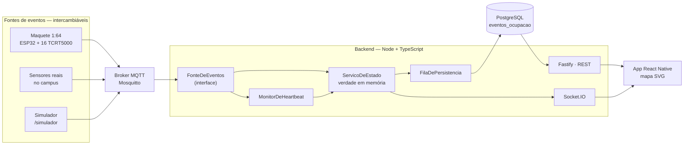

# Arquitetura

## O princípio

**A maquete não é o centro do sistema.** Ela é uma das fontes possíveis de
eventos de ocupação. Maquete física, sensores reais no campus e simulador em
software são intercambiáveis sem alterar uma linha do backend ou do app.

O contrato entre as camadas é sempre o mesmo evento:

> *a vaga X mudou para o estado Y no instante Z*

Tudo o que segue é consequência disso.

---

## Camadas

A `FonteSimulada` entra no mesmo ponto que a `FonteMqtt`, dentro do processo —
por isso `npm run dev:demo` sobe o sistema inteiro sem broker e sem banco.

---

## O caminho de um evento

Um carrinho entra na vaga A3:

1. **Sensor** — o TCRT5000 enxerga reflexão; o LM393 puxa OUT para nível baixo.
2. **Firmware** — a varredura (20 ms) vê a mudança e começa a contar. Passados
   300 ms com a leitura estável, confirma e publica em
   `maua/estacionamento/vaga/A3` com `retain: true`.
3. **Broker** — entrega ao backend, que está assinando `.../vaga/+`.
4. **`FonteMqtt`** — valida o payload e converte em `EventoOcupacao`. A partir
   daqui ninguém sabe mais que isto veio de um sensor.
5. **`ServicoDeEstado`** — compara com o estado corrente. Se for repetição,
   descarta. Se for mudança:
   - **emite no WebSocket primeiro**;
   - enfileira o evento para o histórico;
   - atualiza o espelho em `vagas`.
6. **App** — recebe `{ "vaga": "A3", "estado": "OCUPADA" }` e troca o `fill` de
   um polígono. Nada mais é redesenhado.

A ordem do passo 5 é deliberada: quem está olhando a tela não espera o disco.

---

## Decisões estruturais

### A verdade corrente mora em memória

`ServicoDeEstado` mantém as 16 vagas num `Map`. A tabela `vagas` é espelho.

Consultar o banco a cada mensagem MQTT acrescentaria ida e volta ao disco no
caminho de um evento com orçamento de 500 ms — e o dado é minúsculo e cabe
inteiro na RAM. O banco serve ao histórico, que ninguém está esperando ver.

### O banco sai do caminho crítico

`FilaDePersistencia` acumula eventos por 200 ms e grava tudo num `INSERT` só. Se
a gravação falhar, o erro é registrado e o tempo real continua correto — perder
uma linha de histórico é ruim, travar a tela é pior.

### Repositório como porta

`Repositorio` é uma interface com duas implementações: `RepositorioPostgres` e
`RepositorioMemoria`. Isso existe por um motivo prático de defesa — o sistema
precisa subir na máquina de quem for avaliar, sem Docker e sem banco.

### O `OFFLINE` é um estado de primeira classe

Vaga sem dado recente não é livre. `MonitorDeHeartbeat` marca as vagas de um
controlador como `OFFLINE` após 2 minutos de silêncio, e a transição vai para o
histórico — saber *quando* o sistema perdeu contato é o que permite descontar
esse período das estatísticas depois.

### O identificador não é traduzido

`A3` é o mesmo texto no firmware, no tópico MQTT, na chave primária e no mapa
SVG. Cada camada de tradução seria um lugar a mais para um erro se esconder.

---

## O que foi deliberadamente descartado

| Descartado | Por quê |
|---|---|
| Google Maps ou qualquer API de mapas | não conhece vagas individuais, o zoom não chega ao nível necessário e cria dependência de billing |
| Polling HTTP no app | gasta rádio para receber dados idênticos e chega depois do WebSocket |
| Sensores ultrassônicos HC-SR04 | em 1:64 o feixe abre demais e um sensor lê o carrinho da vaga vizinha |
| Base impressa como peça única | mesa pequena, empenamento e 24 h de fila num único ponto de falha |
| Publicar por polling no MQTT | tráfego constante para informação que quase nunca muda |
| Interrupção (INT) do PCF8574 | 20 ms de varredura é irrelevante diante de 300 ms de debounce |
| Modelo de previsão treinado | com 28 dias de histórico, a sazonalidade semanal explica quase tudo; uma média ponderada é explicável e acerta igual |
