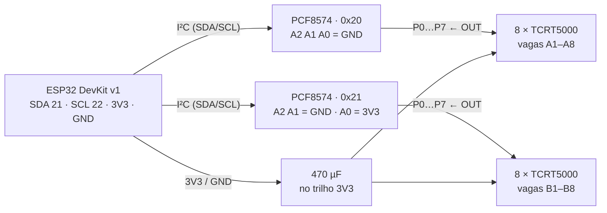

# Maquete 1:64

Estacionamento retilíneo, duas fileiras de 8 vagas frente a frente, corredor
central de mão dupla, calçada em três lados e entrada numa das extremidades.

| Elemento | Real | Maquete |
|---|---|---|
| Vaga | 2,5 × 5,0 m | **40 × 80 mm** |
| Corredor central | 6,0 m | **95 mm** |
| Calçada | 1,6 m | **25 mm** |
| Faixa demarcatória | 12 cm | **2 mm** |
| Placa completa | — | **345 × 305 mm** |

A conta fecha nos dois eixos:

```
comprimento: 25 (calçada de fundo) + 8 × 40 (vagas)                    = 345 mm
profundidade: 25 + 80 (fileira A) + 95 (corredor) + 80 (fileira B) + 25 = 305 mm
```

O mapa do aplicativo usa exatamente estes números como `viewBox` — a planta na
tela é a peça física em escala 1:1 de milímetros. Conferir uma medida na maquete
com paquímetro é conferir o mapa.

---

## Impressão 3D

Um único STL, oito vezes.

```bash
openscad -o modulo_vaga.stl -D 'peca="modulo"'  modulo_vaga.scad
openscad -o calcada.stl     -D 'peca="calcada"' modulo_vaga.scad
```

| Parâmetro | Valor | Por quê |
|---|---|---|
| Filamento | PLA **cinza claro ou branco fosco** | PLA preto absorve infravermelho e mata a leitura do TCRT5000 |
| Altura de camada | 0,2 mm | a faixa demarcatória tem 0,6 mm — três camadas exatas |
| Preenchimento | 15% | a peça não recebe carga; o que importa é não empenar |
| Suportes | não | tudo é rebaixo ou furo passante, nada em balanço |
| Brim | sim, 5 mm | 127 mm de peça plana em PLA levanta as pontas sem brim |
| Tempo | ~3 h por módulo | **8 módulos ≈ 24 h de fila** — este é o maior risco de cronograma |

Cada módulo já sai da impressora com:

- **Furo do sensor** a 30 mm da borda do corredor. Não é o centro da vaga de
  propósito: o Hot Wheels tem vão entre os eixos, e um sensor no centro exato
  enxerga o chão por baixo do carrinho.
- **Berço** de 34,4 × 16,4 mm na face inferior, com 0,4 mm de folga por lado,
  onde a plaquinha do comparador encaixa sem cola.
- **Faixa demarcatória** como rebaixo de 0,6 mm — rebaixo e não ressalto, senão
  vira degrau para o carrinho.
- **Canaleta** de 6 × 6 mm na face inferior, levando o cabo até a borda da
  calçada. Os fios nunca cruzam o corredor.
- **Cauda de andorinha** com 0,3 mm de folga nas laterais. Sem folga, duas peças
  em PLA não entram uma na outra depois da contração da primeira camada.

> Imprima **um** módulo e confira o encaixe e o furo do sensor antes de mandar
> os outros sete. Vinte e quatro horas de impressora é caro demais para
> descobrir um erro de 0,3 mm no fim.

---

## Lista de material

| Qtd | Item | Observação |
|---:|---|---|
| 1 | ESP32 DevKit v1 | |
| 16 | Módulo TCRT5000 com LM393 | infravermelho reflexivo, saída digital |
| 2 | PCF8574 (expansor I²C) | endereços `0x20` e `0x21` |
| 1 | Fonte 5 V / 2 A | alimenta a placa; os sensores ficam em 3,3 V |
| 1 | Capacitor 470 µF | no trilho de alimentação dos sensores |
| 48 | Conector JST ou borne | **nunca solda direta** — 16 sensores × 3 fios |
| 1 | Fita WS2812B com 16 LEDs | opcional, espelha o app na própria maquete |

**Tudo em 3,3 V.** O LM393 opera a partir de 3 V e, a ~4 mm de distância de
leitura, o LED infravermelho tem potência de sobra. Isso elimina o conversor de
nível lógico que seria obrigatório se os sensores rodassem em 5 V — um
componente a menos e 16 canais a menos para dar problema.

---

## Ligação



Os dois expansores ocupam **apenas dois pinos** do ESP32 (SDA e SCL) para os 16
canais. Sem eles seriam 16 GPIOs — mais fios, mais ruído e nenhum pino sobrando.

### Endereçamento

| Expansor | A2 | A1 | A0 | Endereço | Vagas |
|---|:--:|:--:|:--:|---|---|
| Fileira A | GND | GND | GND | `0x20` | A1 … A8 → P0 … P7 |
| Fileira B | GND | GND | 3V3 | `0x21` | B1 … B8 → P0 … P7 |

Essa correspondência aparece uma única vez no firmware, na tabela
`IDS_VAGAS` de [`firmware/src/sensores.cpp`](../firmware/src/sensores.cpp). Se a
fiação mudar, muda-se ali e nada mais.

### Por vaga (× 16)

| Fio | De | Para |
|---|---|---|
| VCC | trilho 3,3 V | VCC do módulo TCRT5000 |
| GND | trilho GND | GND do módulo |
| OUT | `P{n}` do PCF8574 | OUT do módulo |

### O pino INT do PCF8574 não é usado

O PCF8574 sabe avisar por interrupção quando uma entrada muda. Ignoramos isso de
propósito: a varredura roda a cada 20 ms, e 20 ms é irrelevante diante dos 300 ms
de debounce que já existem por necessidade física. Usar INT economizaria tempo
que não faz falta e custaria um fio a mais por expansor, mais tratamento de
interrupção no firmware.

---

## Montagem

1. **Imprima e confira um módulo.** Encaixe um TCRT5000 no berço e um Hot Wheels
   sobre a vaga.
2. **Solde os rabichos** nos 16 módulos de sensor **antes** de encaixá-los na
   placa — com tudo montado, o ferro de solda não alcança.
3. **Encaixe os módulos** um a um pela cauda de andorinha, sempre na mesma
   ordem: A1 → A8, depois B1 → B8, com a numeração crescendo em direção à
   entrada.
4. **Passe os cabos** pelas canaletas até a borda da calçada e etiquete cada um
   com o identificador da vaga. Fio sem etiqueta é meia hora perdida depois.
5. **Ligue os conectores** aos expansores na ordem da tabela acima.
6. **Calibre** — o procedimento está em
   [`docs/calibracao-sensores.md`](../docs/calibracao-sensores.md). Faça isso na
   iluminação do local da apresentação, não na de casa.

---

## Sobre os arquivos deste diretório

`modulo_vaga.scad` é paramétrico: todas as cotas do CLAUDE.md estão declaradas no
topo do arquivo. Mudar a escala da maquete é mudar números ali e reimprimir — não
há geometria escrita à mão.

Os `.stl` não são versionados: são gerados a partir do `.scad` pelos comandos
acima. Guardar binário derivado no Git só cria conflito.
